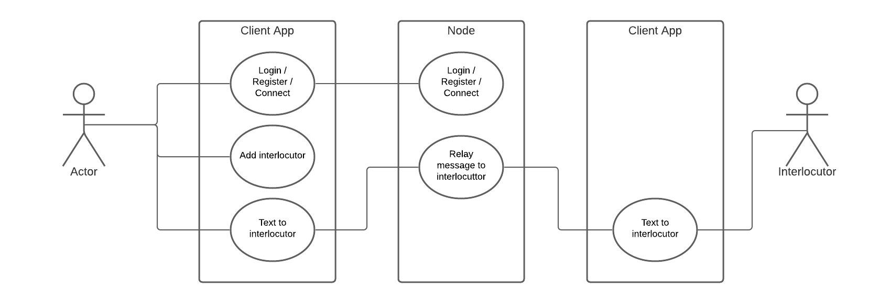
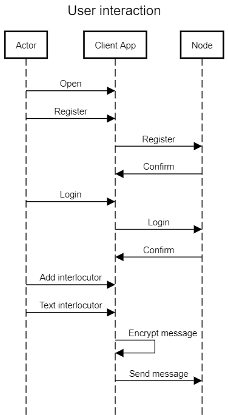
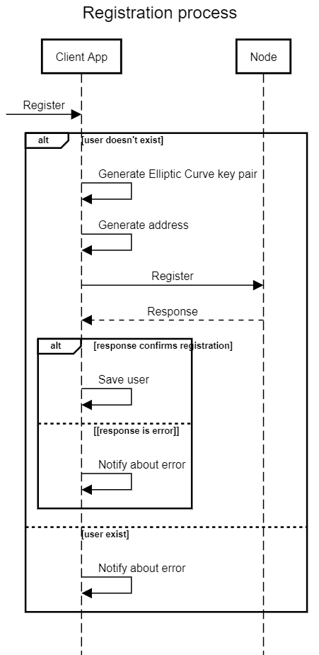

# Your own messenger - *YourMess*

The main features of the *YourMess* messenger are:
 - Messages are stored and owned only by its clients
 - You and your partner have to be online to communicate
 - No need of phone number for registration
 - You have to meet with a real person and get his public key and address before sending message to him
 - Messages are encrypted with Elliptic Curve cryptography

## Technology stack
 - Java 11
 - Spring Boot v2.4.4
 - H2 Database v1.3.175
 - JavaFX for UI

## The Idea
The main idea is to create a distributed mesh of nodes which can cooperate. 
The aim of the nodes is to contain registered users and transmit messages. 
So the node is similar to the relay. It gets a message and sends it to the destination.

Firstly, I wanted to create peer-to-peer messenger based on IPv6 protocol, without servers.
Alas, due to physical network limitation, namely: mostly routers and cell towers support only IPv4,
almost every user is located behind NAT so can't reach directly to peers.

So I have created the server which acts as relay, or mapper between user addresses.


## The Features

Firstly, you need to register, when you have opened the app.
This account is bound to your machine. 
I am planning to add synchronization between machines in the future.

Now, you can share your public key and address to your friend.
Your friend also need to share his public key and address in order to communicate with each other.
Now you can text each other!

## How to build
```shell
./node/gradlew bootJar
./client/gradlew bootJar
```

## How to launch
1. Create folders for clients and node
```shell
mkdir client1 client2 node1
```
2. Copy fatJar to these folders
```shell
cp ./client/build/libs/client-0.0.1-SNAPSHOT.jar ./client1
cp ./client/build/libs/client-0.0.1-SNAPSHOT.jar ./client2

cp ./node/build/libs/node-0.0.1-SNAPSHOT.jar ./node1
```
3. Launch node
```shell
cd ./node1
java -jar node-0.0.1-SNAPSHOT.jar
```
4. Launch clients
```shell
cd ./client1
java -jar client-0.0.1-SNAPSHOT.jar
cd ./client2
java -jar client-0.0.1-SNAPSHOT.jar
```


## Use case diagram


## User interaction sequence diagram


## Registration process sequence diagram

